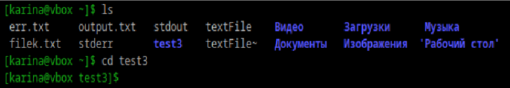
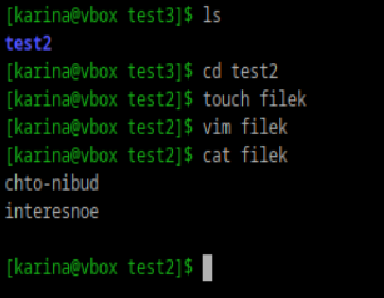
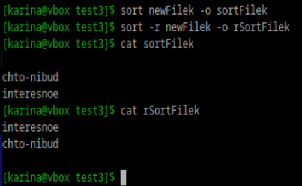
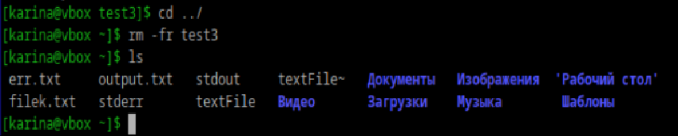

### Переместиться между директориями
 


### Вывести список файлов в директории
```
ls
```

### Вывести список Всех файлов в директории
```
ls -a
```

### Создать папку с подпапками
```
mkdir -p /test2/test1
```

### Внутри папки создать файлик и записать в него что-нибудь



### Переместить файл из одно директории в другую
```
mv filek test1/filek
```

### Скопировать файл из одной директории в другую
```
cp test1/filek ../filek
```

### Переименовать файлик
```
mv filek newFilek
```

### Сравнить содержимое файла
```
diff -q newFilek test2/test1/filek && echo "идентичны" || echo "различны"
# идентичны
```

### Отсортировать содержимоей файла по возрастанию и убыванию



### Удалить все папки и файлы


