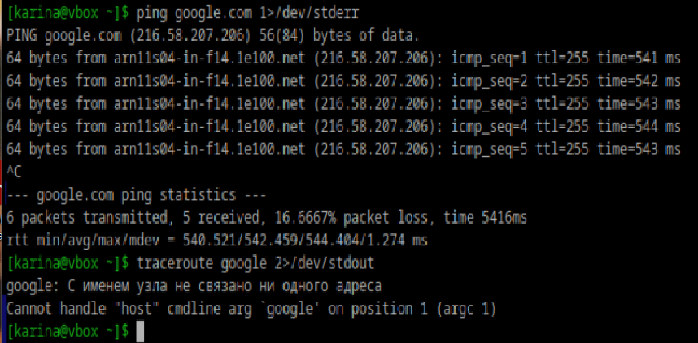

### Как работают команды >,>>?
Команда > перенаправляет вывод предшествующей ей команды в файл, перезаписывая его, а >> записывает вывод в конец файла

### Что такое перенаправление ввода? stderr,stdout
По умолчанию стандартный ввод stdin это устройство ввода (клавиатура). Чтобы перенаправить stdin из файла, используется команда <
stdout - стандартный вывод, для перенаправления используется 1>
stderr - стандартный вывод ошибок, для перенаправления используется 2>

### Вывести содержание файла не используя текстовые редакторы
```
cat filek.txt
```

### Создать файл с содержимым не используя текстовые редактор
```
echo "text vnutri" > newFilek.txt
```

### Пернеаправить stdout в stderr и обратно на примере команды kinit, ping, traceroute



### Чем отличаются stdout и stderr
stdout используется для вывода обычной информации, результатов работы команды\программы
stderr используется для вывода сообщений об ошибках

### Что такое stdin?
Стандартный ввод, по умолчанию - клавиатура

### Как отправить весь вывод команды в пустоту?
```
ping google.com > /dev/null
```

### Можно ли отправить одновременно stdin и stdout в пустоту?
```
cat filek.txt > /dev/null < /dev/null
```
