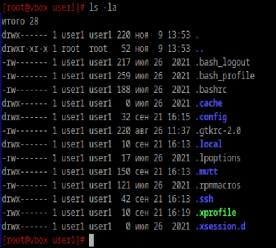
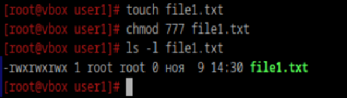
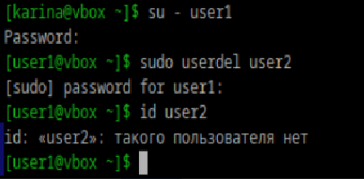
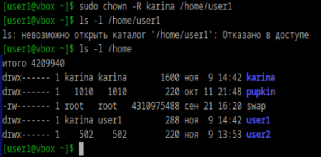

### Добавьте пользователей user1 и user2: 
### 1.1) user1 - оболочка bash 
### 1.2) user2 - оболочка sh 
### 1.3) установите им пароли
```
useradd -s /bin/bash user1
useradd -s /bin/sh user2
passwd user1
passwd user2
```

### Назначьте пользователю 1 группу администраторов, польователя 2 добавте в группу пользователя 1
```
usermod -aG wheel user1
usermod -aG user1 user2
```

### Что такое права доступа? Выведите права доступа на файлы в директории пользователя
Права доступа определяют действия, которые могут выполнять пользователи с файлами и директориями: чтение, запись, выполнение

Все файлы и директории имеют типы прав доступа:
1. Для владельца файла
2. Для пользователей, которые принадлежат к группе файла
3. Для всех остальных пользователей системы



### Как изменить права на файлы? Создайте файл, на который у всех пользователей будут все возможные права



### Как называется учётная запись встренного администратора в linux?
root

### Как выполнить команду от имени администратора?
Перед командой написать `sudo`

### Есть ли ограничения у суперпользователя?
Нет

### Удалите пользователя 2 с помощью пользователя 1.



### Как можно изменить владельца папки? Измените владельца папки из пункта 4



Флаг `-R` рекурсивно меняет владельца для всех файлов и подкаталогов внутри директории
